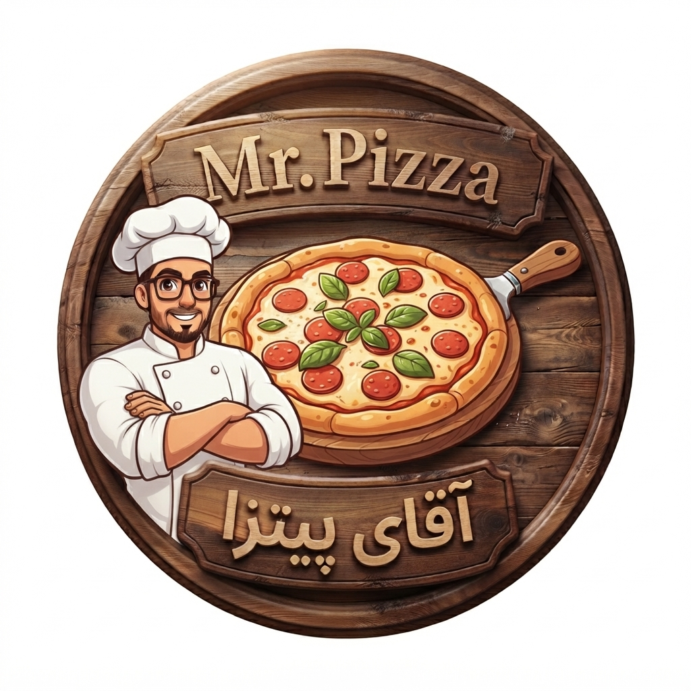

  

# Mr. Pizza 🍕

A simple, beginner-friendly 2D Android game developed using the **Godot Engine**. This project serves as a practical learning experience for understanding mobile game development workflows, scene structures, and the Git/GitHub version control lifecycle.

---

## 🎮 About the Game
**Mr. Pizza** is a lightweight arcade-style mobile game built from scratch. It is designed to run smoothly on Android devices, demonstrating core concepts of 2D game loops, asset management, and touch input handling in Godot.

---

## 🛠️ Technologies & Skills Utilized

* **Game Engine:** Godot Engine (utilizing `project.godot` configuration and internal `.godot` system structures).
* **Target Platform:** Android OS (compiled and packaged into an installable `.apk` file available in the [Releases](https://github.com/alimohammadi05/first-android-game-mr-pizza/releases) section).
* **Asset Organization:** Structured `assets` directory managing sprites, UI elements, and audio files.
* **Version Control:** Git & GitHub (properly configured with `.gitignore` and `.gitattributes` to exclude unnecessary build caches).
* **Open Source:** Licensed under the MIT License, allowing community learning and modification.

---

## 📂 Project Directory Structure

first-android-game-mr-pizza/
├── .godot/              # Godot engine internal cache and configuration files
├── android/             # Android export templates and custom build configuration
├── assets/              # Game resources (sprites, audio, fonts, scenes)
├── export_presets.cfg   # Export profiles and settings for Android packaging
├── project.godot        # Main configuration file for the Godot project
├── pizza-logo.jpg       # Game logo image displayed in the README
└── LICENSE              # MIT open-source license

*(Note: Binary files like the `.apk` are managed under GitHub Releases to keep the repository lightweight.)*

---

## 🚀 How to Run & Play

### Option 1: Play on Android
1. Head over to the [Releases page](https://github.com/alimohammadi05/first-android-game-mr-pizza/releases).
2. Download the latest **`Mr. Pizza.apk`** file.
3. Install and run it on your Android device.

### Option 2: Open Source Project in Godot
1. Download or clone this repository to your local machine.
2. Open **Godot Engine** (v4.x recommended).
3. Click **Import** and select the `project.godot` file from the project root directory.
4. Explore, modify, and test the game directly inside the engine editor!

---

